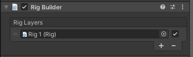
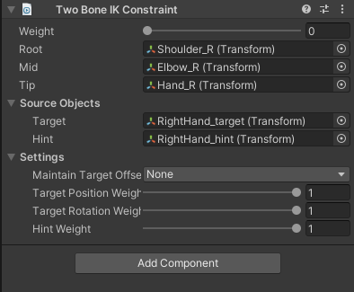
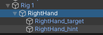

# Program: Basic Demo Unity
Program description: This program just using for demo/learn demo, for only purpose learning and self teaching myself. Main feature: Basic Movement, Basic Rotate Camera, Basic Inverse Kinematic, Basic Interact with interactable items <br />
Creator: NgocPHV <br />
Date Created: 27/06/2023 - 17:30 (AM GMT +7) <br />
Date Updated: 02/07/2023 - 16:15 (PM GMT +7)  <br />
Date Finished: - <br />

# Index content
* [General info](#general-info)
* [Technologies](#technologies)
* [Update info](#update-info)
* [Feature](#feature)
* [Explain](#explain)
* [Demo](#demo)

# General info
- Basic Demo for self-teaching myself.
- User can move, rotate camera, jump, sprint.
- Feet will dynamic set position depending on ground surface, IK for foot.

# Technologies
- This Demo using Unity 2021.3.26f1
- Unity Package: Cinemachine, Input System, Animation Rigging
- Unity Asset: Starter Assets - Third Person Character Controller, POLYGON Starter Pack - Low Poly 3D Art by Synty

# Update info
## 29/06/2023 - 14:21 (GMT +7):
- Add Inverse Kinematic for Foot by using Animator IK
- This is still has alot of bug in Foot when go to "Walkable" tag
## 02/07/2023 - 16:15 (GMT +7):
- Add Inverse Kinematic for Foot by using Animator IK with advance method
- Update Readme.md

# Feature
- Rotate Camera
- Character Movement, jump, sprint
- Interact with interactable item
- IK Animation
- IK for Feet

# Explain
## Rotation Camera:
- Set the following target for camera, we will only change the rotation of this.
- By using Camera Yaw and Camera Pitch, reset the rotation for Camera Follow Target every single frame in Late Update
- The Camera Yaw will has initial data same with current camera rotation in eulerangle.y
```
CameraYaw = Camera.main.transform.rotation.eulerAngles.y;
```
- Get current mouse position from mouse input and next, set the data into Camera Yaw and Pitch
```
Vector2 currentCameraPosition = InputManager.Instance.LookVector2;
...
CameraYaw += currentCameraPosition.x;
CameraPitch += currentCameraPosition.y;
...
//clamp the angle of yaw and pitch with min and max value
//coding in there

//set camera rotation by change the rotation of follow target
CameraFollowTarget.transform.rotation = Quaternion.Euler(_cameraPitch, _cameraYaw, 0);
```

## Movement:
- Movement of character will be depended into the camera rotate value
- Get value of input from user
- Get current speed by checking if user pressed sprint button or not
- Set value for vector 3 input direction from vector 2 input user
```
Vector3 inputDirection =  new Vector3(userInput.x, 0, userInput.y).normalized;
```
- Check if input has value <> zero vector, set rotation for it:
```
//get target rotation by getting Atan2 of x and z from input Direction and adding with euler andgle y of camera
targetRotation = Mathf.Atan2(inputDirection.x, inputDirection.z) * Mathf.Rad2Deg 
                                + Camera.main.transform.rotation.eulerAngles.y;
//get rotation for character by using smoothdampangle
rotation = Mathf.SmoothDampAngle(transform.eulerAngles.y, targetRotation, ref _refVelocity, smoothValue);
//rotate it frame by frame
transform.rotation = Quaternion.Euler(0, rotation, 0);
```
- Get movement vector 3 by using vector forward of character multiply with euler from targetRotation (targetRotation will be placed in Y parameter of this Euler function)
- And move Character
```
Vector3 movement = Quaternion.Euler(0, targetRotation, 0) * Vector3.forward;
characterController.Move(movement.normalized * speed * Time.deltaTime);
```

## Inverse Kinematic:
- This IK has two content:
  * IK animation for interact with interactable object, [IK Animation](#ik-animation)
  * IK for feet landing in surface, [Foot IK](#foot-ik)
 
### IK Animation:
- This is using the feature of Unity, Animation Rigging
- First, Choise "Rig Setup" in Animation Rigging, Unity will automatically create a new script "Rig Builder" and set the Rig setup has been create into <br />

- Next, create new empty object in "Rig 1" Game Object, in this new empty object, add new Component "Two Bone IK Constraint" <br />
 <br />
 <br />
- Create new animation from this rigs, we wil has the animation like this
<br />
- This animation has setting the IK Position on animation Event
Script (this is animation event in animation)
```
//Set position grab item
private void GrabItemPosition(AnimationEvent animationEvent)
{
    RightHandIK.position = _weaponSelect.position;
}
//When item in hand, remove collider and set kinematic to true
private void GrabItemInHand(AnimationEvent animationEvent)
{
    _weaponSelect.GetComponent<Collider>().enabled = false;
    _weaponSelect.GetComponent<Rigidbody>().isKinematic = true;
    _weaponSelect.parent = RightHandIK;
    _weaponSelect.localPosition = Vector3.zero;
    
}
//Do something when it finish, grab finish
private void GrabItemStore(AnimationEvent animationEvent)
{
    Destroy(_weaponSelect.gameObject);
}
```

### Foot IK: 
This foot IK, has two options for creating this IK:
- Basic Create, just using IK and Raycast, (Basic setting)[#basic-setting]
- Advance Create, using IK, Raycast, last position to check and set new position, (Advance setting)[#advance-setting]

#### Basic Setting
(* This setting has been created by reference to this guide: [link](https://www.youtube.com/watch?v=rGB1ipH6DrM) )
- First, need setting the curve for float value that has been set in Animator (the curve setting depending on foot place in animation):
 <br />
 <br />
- Next, setting in the code:
  * Get value to setting for weight in IK Setting (this setting will be set in OnAnimationIK event)
```
//Position and Rotation for Left Foot
Animator.SetIKPositionWeight(AvatarIKGoal.LeftFoot, Animator.GetFloat("IKLeftFoot"));
Animator.SetIKRotationWeight(AvatarIKGoal.LeftFoot, Animator.GetFloat("IKLeftFoot"));
//Position and Rotation for Right Foot
Animator.SetIKPositionWeight(AvatarIKGoal.RightFoot, Animator.GetFloat("IKRightFoot"));
Animator.SetIKRotationWeight(AvatarIKGoal.RightFoot, Animator.GetFloat("IKRightFoot"));
```
  * Create a raycast to check and setting new landing position if available:
```
//left foot
//Create a Ray cast with start position is leftfoot but up -> down
RaycastHit hitInfo;
Ray ray = new Ray(Animator.GetIKPosition(AvatarIKGoal.LeftFoot) + Vector3.up, Vector3.down);
if (Physics.Raycast(ray, out hitInfo, _distanceToGround + 1f, _hitLayer)) 
{
    if (hitInfo.transform.gameObject.CompareTag("Walkable"))
    {
        Vector3 footPosition = hitInfo.point; //get position of hit value => this is land point for foot
        footPosition.y += _distanceToGround;
        Animator.SetIKPosition(AvatarIKGoal.LeftFoot, footPosition);
        Animator.SetIKRotation(AvatarIKGoal.LeftFoot, Quaternion.LookRotation(transform.forward, hitInfo.normal));
    }
}
//Right foot
//Setting same with leftfoot, but change the left value to right value
...
```
- This basic method is very easy to set, but has limit in in realtime action in game action, see this gif:

( This Character's foots is placed wrong place, and the model doesn't change to fit with the landing of foot )
- Because this bug/lack of the logic in handle landing of foot, move to next Method will solve this problem

#### Advance Setting
(* This advance method setting has been guided by this video: [link](https://www.youtube.com/watch?v=MonxKdgxi2w)


  
